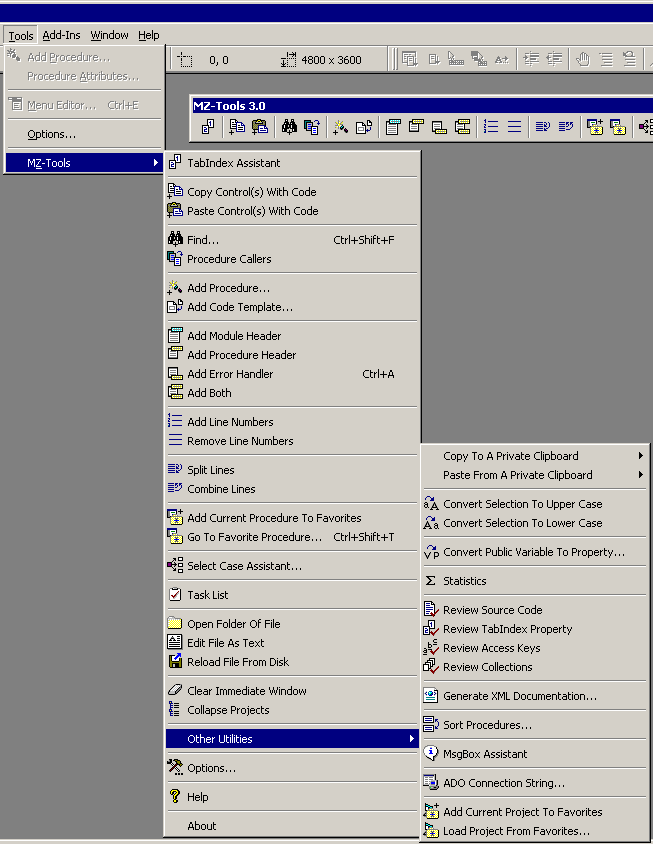



## MZ\-Tools 3\.0 \(the Ultimate VB6 AddIn\)

### Description

MZ-Tools 3.0 is a freeware add-in for VB 5.0, 6.0 and the VBA (Office) which adds several productivity features to the IDE. You can download it from www.mztools.com, i am using this addin for 1.5 years and my productivity has really increased. i really like its feature particularly 'clear intermediate windows', 'close all windows' and 'procedure caller'. Take a look at my other PSC submission ID: 58620 & 58651
 
### More Info
 

             |
---                |---
**Submitted On**   |
**By**             |[Abhishek\.NET](https://github.com/Planet-Source-Code/PSCIndex/blob/master/ByAuthor/abhishek-net.md)
**Level**          |Intermediate
**User Rating**    |4.7 (71 globes from 15 users)
**Compatibility**  |VB 4\.0 \(32\-bit\), VB 5\.0, VB 6\.0, VB Script, VBA MS Access, VBA MS Excel
**Category**       |[Miscellaneous](https://github.com/Planet-Source-Code/PSCIndex/blob/master/ByCategory/miscellaneous__1-1.md)
**World**          |[Visual Basic](https://github.com/Planet-Source-Code/PSCIndex/blob/master/ByWorld/visual-basic.md)
**Archive File**   |

### Source Code

<b>MZ-Tools 3.0</b> is a <b>freeware</b> 'all-in-one' add-in for <b>Visual
Basic 6.0,&nbsp;Visual Basic 5.0 </b>and the <b>Visual Basic For Applications</b>
editor (provided by a VBA-enabled application such as the ones of Office 2000
and higher) which adds several productivity features to the IDE. It provides a
main menu, a toolbar, handy context menus or customizable shortcuts to access
those features.

Through a dialog window, you can customize several add-in
features to meet your development standards (data type prefixes, template for
procedure headers, template for error handler, etc.) or your personal
preferences (user name, shortcuts, etc.)

For your convenience, the add-in has been localized in the
following languages: English, Spanish, French, Italian, German and Portuguese.
Although it is very easy to use the add-in, a help file in HTML Help format is
also included, with complete documentation.

Installation is as simple as downloading the add-in (a .zip
file) to a single folder, unzipping the files and registering the DLL file with
regsvr32.exe. If you are using the version of the add-in for VB5, you need to
add the entry MZTools3VB5.Connect=1 to the vbaddin.ini file of your Windows
directory. If for any reason you do not like the add-in and want to uninstall
it, simply unregister it with regsvr32.exe /u and delete the files. The add-in
only uses components of Visual Basic 6.0, without 3rd party components.&nbsp;

You can run the add-in from a local disk or from a network
shared folder (probably read-only to ensure that all developers of a team are
using the same add-in customization established by a team leader).

<h2>Features</h2>

The feature set of MZ-Tools 3.0 is the following (notice that not all
features of the add-in for Visual Basic 6.0 / 5.0 are present in the version for
VBA, as it is explained in the help file): 
&nbsp;

<h3>TabIndex Assistant</h3>

The TabIndex Assistant is shown to the left. It shows the
controls of the selected file in the Project Explorer of Visual Basic, sorted by
their TabIndex property. To change the TabIndex property of a control, you can
use the buttons with the up and down arrows or drag and drop a control in the
list to a new position (multiple drag and drop is supported). However, the
fastest way to assign the right TabIndex property to each control is clicking
the <b>Automatic </b>button.

When you select a control of the list, if the file which it
belongs to has the designer window open, the control is selected in the
designer. A very useful way to check if the controls are sorted properly is to
select the first control of the list and with the Down Arrow key of the keyboard
select the next control, checking in the designer window if the order is right.

Controls are indented showing the hierarchy in the form and
optionally you can see a warning icon for the controls with a wrong TabIndex
property.

<h3>Review TabIndex Property</h3>

The add-in can review the TabIndex property of the files which use controls
at project-group, project or file level (through context menus). This review
uses the same algorithm as the TabIndex Assistant to check if the controls have
the right TabIndex property.

The results are shown in a Results Window. The
review of the TabIndex property can be launched automatically (or you can be
asked) when you make the executable of a project, that is, clicking some of the
<b>File | Make ...</b> menus (this is customizable through the Options window).

<h3>Find In All Projects</h3>

The add-in can find strings in a procedure, module, project, project group or
selected text. The results are shown in a Results
Window which allows you to locate the line within the code window. 

<h3>Replace In All Projects</h3>

From the Results window after a search, you can replace the occurrences found
with a new string, one by one or all at the same time. With this two-step
approach, you can exclude occurrences from the list (simply deleting them)
before the replacing operation.

<h3>Add Procedure</h3>

With an add-in window, you can add properties, functions or subroutines to
the code. In contrast to the window that Visual Basic uses, in the add-in window
you can select the data type (String, Long, Control, Collection ...). In
addition, you can add a procedure header and/or error handler in the same step.
Even if you do not use this kind of dialogs usually to create procedures, you
will find it useful when generating multiple pairs of properties Get / Let or
Set.

You can set nomenclature prefixes for the name of variables that the add-in
will generate in the Options window.

<h3>Add Procedure Header</h3>

You can add a header to a procedure (above or below the declaration) with a
customizable template which can include predefined variables. 

<h3>Add Error Handler</h3>

You can add an error handler to a procedure with a customizable template. If
the procedure body is not empty, the add-in merges the error handler with the
procedure code. 

<h3>Add Both</h3>

You can add the header and error handler to a procedure in one step, to save
time. 

<h3>Add Module Header</h3>

You can add a header to a module with a customizable template which can
include predefined variables. 

<h3>Procedure Callers</h3>

The add-in can find the procedures which call a given procedure. The results
are shown in a Results Window which allows you to
locate the line within the code window. 

I have rewritten the code parser almost from scratch for this version 3.0 and
this &quot;second generation&quot; parser (it was untouched from version 1.0) can resolve
the context of calls in most situations. That means that if you have two classes
with the same &quot;Init&quot; method, and you want to know the calls to the &quot;Init&quot; method
of the first class, the Procedure Callers feature does not show the calls to the
&quot;Init&quot; method of the second class.

<h3>Review Collections</h3>

The add-in can review the files that are collections at project-group,
project or file level (through context menus). When a class file (.cls
extension) is reviewed, if it contains the Item or NewEnum methods it is
considered a collection. In this case, the following requirements are reviewed:

<ul>
 <li>If it has the Item method, it must have the NewEnum method (implemented as
 Function or Property Get). </li>
 <li>
 
If it has the NewEnum method, it must have the
 Item method (implemented as Function or Property Get). </li>
 <li>
 
The NewEnum method must have Procedure ID -4. </li>
 <li>
 
The Item method must have Procedure ID 0
 (Default). </li>
</ul>

The results are shown in a Results Window. The
collections review can be launched automatically (or you can be asked) when you
make the executable of a project, that is, clicking some of the <b>File | Make
...</b> menus (this is customizable through the Options window). 

<h3>Clear Immediate Window</h3>

Visual Basic does not offer a handy way to clear the contents of the
Immediate Window. There is no context menu and the Debug object lacks of the
Clear method. The only way to clear the Immediate Window is selecting the text
(Control + A) and then pressing the Del key. The add-in offers a button and a
context menu to clear that window.

<h3>Task List</h3>

The add-in offers a task list for each project (in fact, the tasks are saved
in the .vbp file). For each task you can enter the description, priority,
assigned person, status and comments. You can filter the list by status,
priority or assigned person, sort the tasks by any field, export them to a text
file (tab delimited) or copy them to the clipboard to paste them in Microsoft
Excel, for example.

&nbsp;

<h3>Line Numbering</h3>

You can add or remove line numbers to a procedure, module, project or project
group through the corresponding context menu in the Project Explorer. This
feature is useful if you use the (undocumented) Erl function in your error
handlers to know the line that caused the error.&nbsp;You can define the increment
used and if global numbers should be used in the Options window.

<h3>Statistics</h3>

The add-in can show statistics (number of code lines, comment lines, total
lines, procedures and controls, along with totals) of your source code at
project-group, project or file level (through context menus). Blank lines are
excluded from the statistics. You can sort the results, export them to a text
file (tab delimited) or copy them to the clipboard to paste them in Microsoft
Excel, for example. 

&nbsp;

<h3>Copy And Paste Controls With Code</h3>

With this feature, you can copy and paste controls with related code (events)
from one form to another.

<h3>Rename Controls With Code</h3>

When this feature is active (it can be disabled through the Options window),
each time you rename a control in a form which is not part of an array, the
related code (events and occurrences in the code of that form) is also renamed
accordingly, saving time to you.

<h3>Controls Default Properties</h3>

When this feature is active (it can be disabled through the Options window),
each time you add a control to a form, the add-in applies the default properties
that you have customized in the Options window. Some useful properties you will
want to change are the name of the controls (to use your own prefixes), the
Caption or Text properties (to use empty values), the height of Labels or
TextBoxes, the LabelEdit or View properties of listviews, and so on.

<h3>Prompt for Name and Caption Properties When Adding a Control</h3>

When this feature is active (it can be disabled through the Options window),
each time you add a control to a form, you are asked for the Name and Caption
(if applies) of the new control.

<h3>Reload File From Disk</h3>

With this feature, you can reload a previously saved copy of a file of your
project without reloading the whole project.

<h3>Remove Debug Files (.lib and .exp) When Closing Project</h3>

When this feature is active (it can be disabled through the Options window),
after closing a project the add-in removes the debug files (.lib and .exp
extensions), if present, that VB generates when making a DLL and that normally
you will not use.

<h3>Close Windows</h3>

With the add-in you can close all current open windows with one click.
Optionally you can keep open the active window.

<h3>Add Multiple Files To Project</h3>

When this feature is active (it can be disabled through the Options window),
the add-in intercepts the <b>Add File...</b> buttons and the Ctrl+D shortcut to
show an <b>Add File</b> dialog that allows multiselection. In addition, you do
not have to specify if the file is a &quot;related document&quot; since the add-in detects
it automatically according to the extension of the file.&nbsp;

<h3>Shortcuts To Built-in IDE Features</h3>

The add-in offers customizable shortcuts to these built-in features of the
IDE, avoiding the use of the mouse:

<ul>
 <li>Comment / Uncomment Block </li>
 <li>Bookmarks buttons </li>
 <li>Remove File Of Project </li>
 <li>Toggle visibility of the Watch Window and Locals Window </li>
</ul>
<h3>Shortcut To Save File At Debug-Time or Run-Time</h3>

You can define a shortcut to save the selected file at debug-time or
run-time. Although Visual Basic does not allow to save files at debug-time or
run-time, often it is useful to save the modifications that you have made to the
source code at those times.

<h3>Code Templates</h3>

You can create code templates in the Options window for code snippets that
you insert frequently in your source code. To insert a code template in your
source code, you can select it from a list with all code templates, or you can
define a shortcut for each one for greater productivity.

Code templates can include predefined variables (such as author, current
date, procedure name, cursor position after insertion, etc.) but also can
include user-defined variables, that is, your own variables. When you insert in
the source code a code template with user-defined variables, a dialog asks you
the values of those variables. For example, you can define a code template to
create a collection class with a user-defined variable which is the name of the
class of the objects that the collection will hold, used in the Item() and Add()
methods.

<h3>Review Source Code</h3>

The add-in can review your source code at project-group, project or file
level (through context menus) detecting unused variables, constants, parameters,
private procedures, and so on. For performance reasons, only private
declarations are reviewed.

The results are shown in a Results Window. The
source code review can be launched automatically (or you can be asked) when you
make the executable of a project, that is, clicking some of the <b>File | Make
...</b> menus (this is customizable through the Options window). 

<h3>Select Case Assistant For Enum Expressions</h3>

Leveraging the rewritten code parser of this version 3.0, when you write in a
code window a Select Case &lt;Enum expression&gt; statement such as

&nbsp;&nbsp;&nbsp; Select Case
m_ctlListView.ColumnHeaders(1).Alignment

and you invoke this assistant (with a shortcut for greater productivity) a
window as the following appears:

&nbsp;

With this window, you can choose the values of the enum expression which
require a separate Case statement. If you leave enum values not selected, a Case
Else statement is added.

<h3>Favorite Projects</h3>

With this feature you can create a list with the projects that you use
frequently and you can load them (closing the current Visual Basic instance or
not):

&nbsp;

This feature is intended to replace the Recent Projects feature of Visual
Basic, which has a couple of flaws: a recent project is not always a favorite
project and you can not delete a recent project without digging into the
registry.&nbsp;

<h3>Favorite Procedures</h3>

With this feature you can create a persistent list with the procedures of a
project that you use frequently and you can go to one of them selecting it in
the list.&nbsp;

This feature is intended to replace the bookmarks feature of Visual Basic,
which has a couple of flaws: bookmarks are not persistent among sessions and
bookmarks are not named (you can only go to the next or to the previous one).&nbsp;

<h3>Private Clipboards</h3>

The add-in provides 9 private clipboards. You can copy and paste snippets of
code using a specific clipboard directly (with customizable shortcuts or menus)
or you can use a window that the add-in provides which shows the content of each
clipboard:

&nbsp;

<h3>External Utilities</h3>

You can include (through the Options window) your own external utilities,
that will be added at the bottom of the <b>Other Utilities</b> menu of the
toolbar. For example, you can include as external utilities your favorite icon
editor, database tool, etc. and even scripts, documents or URLs. In addition,
you can pass to each external utility the file name of the current module,
project or project group.

&nbsp;

<h3>MsgBox Assistant</h3>

The add-in provides a window to generate easily message boxes.&nbsp;

<h3>XML Documentation</h3>

The add-in can generate an XML file with documentation at project group,
project or file level (through context menus). The XML file includes elements
such as References, Projects, Files, Procedures, Parameters, Controls, etc. Each
element such as a Reference, Procedure, Parameter, etc. include sub-elements
with relevant properties. For example, for the Parameter element you have the
type, optional, default value, etc.&nbsp;

The XML file also includes comment line elements for module and procedure
elements whose content is extracted from the source code (provided you have
entered them). Comments are extracted line by line as literals, so you can use
any format for them, that is, they do not need to be XML compliant.

Although not required, the add-in allows you to include a reference to an
XSLT template in the XML file when is generated, which allows you to format the
XML file for viewing it with Microsoft Internet Explorer 5.0 or higher.

There are a lot of uses for the XML file. As example, I provide an XSLT
template that you can customize which uses also CSS, JavaScript and DHTML to
expose the XML documentation as a HTML report for documentation purposes.

Although the add-in does not require the Microsoft XML Parser to generate the
XML file, you will need it (specifically Microsoft XML Parser 3.0 SP1 or higher
in Replace Mode) to use XSLT templates.&nbsp;

XML and XSLT can be confusing (and frustrating) to use at first, but even
with no previous knowledge you can manage it in a couple of weeks. In my
opinion, it is one of the most powerful and impressive technologies of the last
years.

<h3>Sort Procedures</h3>

The add-in can show a window with all the procedures of the current file. In
this window, you can rearrange the order of the procedures by scope, name, type
or manually. The list supports multiple drag &amp; drop for easier use.

<h3>Split / Combine Lines</h3>

You can split (insert line continuation characters) or combine lines in
source code at project-group, project, file, procedure or selection level. The
maximum length of a line is customizable in the Options window.

<h3>Convert Selection To Upper / Lower Case</h3>

You can convert the selected text to upper or lower case. This is useful when
converting constants (typically in upper case) to enum values (typically in
lower case) or vice versa.

<h3>Edit File As Text</h3>

This feature allows you to edit a file of your project (such as a form) with
the editor that you have associated with .txt files (typically Notepad, but it
can be a better one). You can modify it, save it and reload it with the Reload
File From Disk feature.&nbsp;

<h3>Open Folder Of File</h3>

With this feature you can open the folder of a saved file. It is handy in
some situations.

<h3>ADO Connection String</h3>

The add-in can show the Data Links dialog of OLE DB to create a connection
string. When you accept the dialog, the connection string is copied to the
clipboard, and you can paste it into your source code, configuration file, etc.

<h3>Collapse Projects</h3>

This feature allows you to collapse the projects of the Project Explorer with
one click. It is very handy for the number of files of current applications.&nbsp;

This feature also fixes an annoying bug that you may have seen in the Project
Explorer:

<ul>
 <li>Open Visual Basic. Project1 and Form1 are created by default. </li>
 <li>Add a second form, Form2. </li>
 <li>In the Project Explorer, click in the Form1. The Form1 item is selected.
 </li>
 <li>Right-click in the Form2 item. The context menu appears. </li>
 <li>While the context menu is shown, click with the left button of the mouse
 in the Form1 item. The context menu is closed and the Form1 item has the
 rectangle border of the selected item (which is right) but the Form2 item
 remains with the blue background forever. Clicking the Collapse Projects
 button of the add-in fixes this problem. </li>
</ul>
<h3>Review Access Keys</h3>

The add-in can review access keys (the underlined character of dialog
controls) at project-group, project or file level (through context menus)
detecting controls without access key or collisions among access keys.

The results are shown in a Results Window. The
access keys review can be launched automatically (or you can be asked) when you
make the executable of a project, that is, clicking some of the <b>File | Make
...</b> menus (this is customizable through the Options window). 

<h3>Convert Public Variable To Property</h3>

If you put the cursor in a line as the following:

Public Count As Long

then, when you invoke this feature the line is parsed and the corresponding
values are pre-selected in the Add Procedure dialog. If you click the Add
button, the member variable will be converted to a pair Property Get/Let.

<h3>Fix VB registry entries to prevent character ~ when opening VB files by
double-clicking them</h3>

By default, after installing Visual Basic when you double-click a .vbp, .vbg
or other VB extension file, the file is loaded as short file name instead long
file name. See MSDN Knowledge Base Article Q149863: &quot;PRB: Long Filenames Lost
when Project is Loaded by Association&quot;. The add-in corrects this problem
automatically.

<h3>Add-in Features Working At Debug or Run-Time</h3>

In a perfect world (such as the VB.Net world, perhaps) this should not be a
feature, but in the VB5 / VB6 world officially add-ins can not run at debug or
run-time. Although this is also a popular belief, it is not true, but as far as
I have seen, this is the first add-in with this &quot;feature&quot;. The only caveat for
you, as user, is that you must invoke the features through shortcuts instead of
menus. Violating Microsoft rules running the add-in at debug or run-time modes
means that internally there are some traps that can cause GPFs but hopefully I
have shielded the add-in against all of them, so you can run the add-in safely
in those modes. Note that most features of the add-in (such as TabIndex
Assistant, Statistics, Reviews, and so on) are intended only for design-time
mode, but you can run the features that have sense at debug or run-time such as
Procedure Callers or Find.

<h3>Customization For Usability</h3>

The add-in has been carefully designed with usability in mind. For example,
to save space the toolbar is automatically hidden in the VB6 version of the
add-in at run-time or debug-time, since you can use it only at design-time.&nbsp;

Apart from customizing features (templates, default properties for controls,
and so on), the add-in is highly customizable to feel yourself comfortable using
it. Some settings that you can customize are:

<ul>
 <li>Shortcuts to all features </li>
 <li>Buttons on the toolbar </li>
 <li>Position and visibility of the toolbar </li>
 <li>Size of windows </li>
 <li>The add-in language (English, Spanish, French, Italian, German and
 Portuguese) </li>
</ul>

Of course, all these settings are preserved among sessions.

<h3>Results Window</h3>

The treeview of the window shows code lines which belong to the result of the
operation performed, if it is an operation that must show code lines. You can go
to the code line in the code window of Visual Basic double-clicking on it or
pressing the Enter key if the line is selected in the treeview. You can also
remove code lines from the results window pressing the Del key (this feature is
useful if you are using the results as a &quot;To Do&quot; list). You can define a
customizable shortcut to return to the last results window used, avoiding
totally the use of the mouse while switching between a code window and a results
window.

Finally, you can also export the results to a text file (tab delimited) or
copy them to the clipboard.

